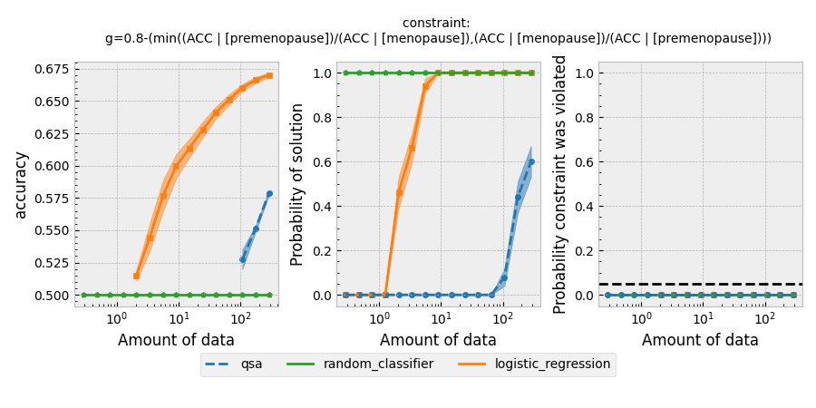
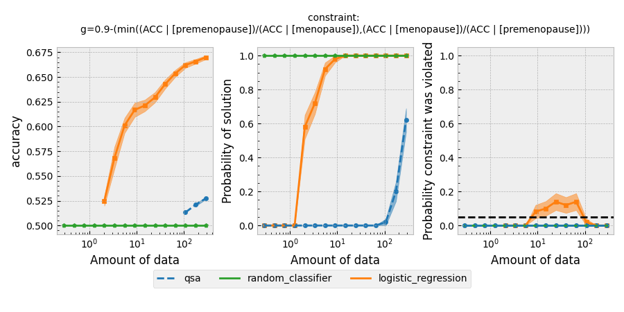
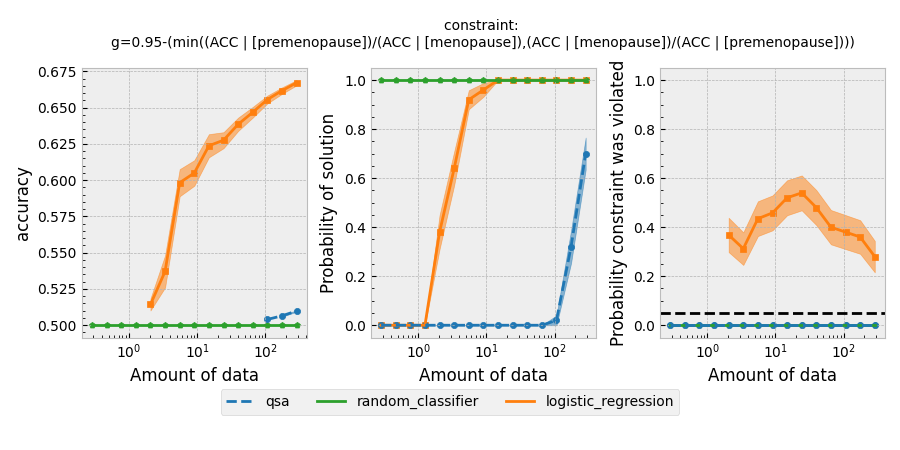
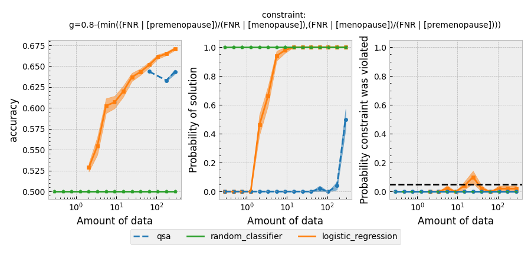
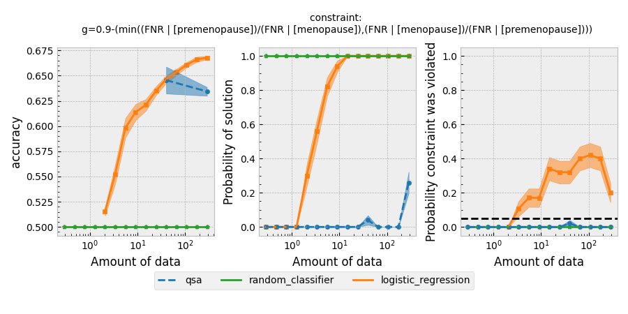
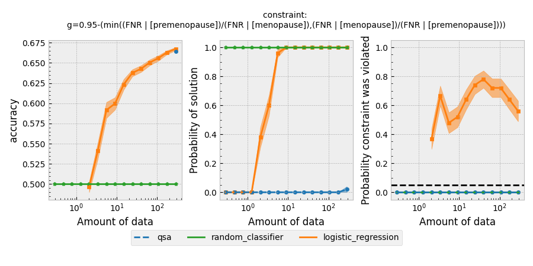

# Fairness for Breast Cancer Recurrence Prediction
An application of the Seldonian Machine Learning Toolkit for breast cancer recurrence prediction that is fair based on menopausal status. 

By Derek Lacy. For the 2023 Seldonian Toolkit Competition

## Introduction
In the United States, around 1 in 8 women develop breast cancer. Breast cancer rates are higher in older, post menopausal women, especially women who experienced late menopause. However, women of all ages can be affected by breast cancer. Of women diagnosed with and treated for breast cancer, between 3% and 15% experience a recurrence within 10 years. It is known that people who develop breast cancer before age 35 are more likely to get a recurrence, but otherwise medical experts do not know why some experience recurrence and others do not. With a fair way of predicting recurrence, doctors could provide more effective and continued care to those who are likely to need it, and certain demographics of patients would not be at a disadvantage.

Using the Seldonian Toolkit, I trained a logistic regression model to predict who will and will not experience breast cancer recurrence. I ensured fairness based on menopausal status with two different definitions of fairness. I used a dataset called the ["Breast Cancer Data Set"](https://archive.ics.uci.edu/ml/datasets/Breast+Cancer) found in the UCI Machine Learning Repository provided by the Oncology Institute. The unprocessed data (found at `./data/breast-cancer.csv`) provides 286 instances of 9 breast cancer patient features including menopause satatus which can be used to predict breast cancer recurrence. More information on the data can be found in `./data/breast-cancer.txt`

## Dataset preparation
In `dataProcessing.ipynb`, I process the data to be used in the Seldonian Toolkit. I first define the label column to be 'recurrence-events' and rename it to recurrence. I then change the menopause column to contain only true or false values. I make 'lt40' and 'ge40' (2 values meaning post menopause) True and change 'premeno' values to False. I also change the values in 'nodes-cap' and 'iradiat' columns to boolean values. I then one hot encode all the columns of the data set (all features are categorical) and I label encode the labels dataframe. I then join the features and labels back to one dataframe, randomize the rows, and raname columns "menopause_False" and "menopause_True" to "premenopause" and "menopause". Finally, I save the processed data as a csv (`data/BC_Data_Proc.csv`) and define and save the metadata needed for the Seldonian Engine (`data/metadata_breast_cancer.json`). 

## Formulate the Seldonian ML problem
I use two definitions of fairness for my application of the Seldonian Algorithm. Overall accuracy equality ensures that the prediction accuracy is similar for pre and post menopausal patients. Equalized odds ensures that the false negative rate (rate of predicting no recurrence when there will be one) is similar between both groups. Here are their formal definitions:
1. Overall accuracy equality: 
$\min((\mathrm{ACC} | [\mathrm{premenopause}])/(\mathrm{ACC} | [\mathrm{menopause}]),(\mathrm{ACC} | [\mathrm{menopause}])/(\mathrm{ACC} | [\mathrm{premenopause}])) \geq (1-\epsilon)$

2. Equalized odds: 
$\min((\mathrm{FNR} | [\mathrm{premenopause}])/(\mathrm{FNR} | [\mathrm{menopause}]),(\mathrm{FNR} | [\mathrm{menopause}])/(\mathrm{FNR} | [\mathrm{premenopause}])) \geq (1-\epsilon)$

I use 0.2, 0.1, 0.05 as $\epsilon$ values which mean ACC or FNR must be within 20%, 10% and 5% for both groups. I set $\delta = 0.05$ for all 6 combinations of the 2 fairness definitions and 3 values of $\epsilon$.

## Creating the specification object
In `createSpecs.py`, I create 6 spec objects, each for a different combination of a fairness definition with a value for $\epsilon$. The spec objects are saved in `./specs/`.

## Running a Seldonian Experiment
In `generateAllPlots.py`, I run 6 experiments for the 6 spec objects. Each experiment uses a quasi-Seldonian model "qsa" representing one of the 2 fairness definitions with one of the 3 epsilon values. In each experiment, the qsa is compared to a baseline regression model and a random classifier. The models are compared on accuracy, probability of solution, and probability constraint was violated based on different amounts of training data. Each model is compared on 15 different amounts of training data each with 50 trials. 

This program saves results and resampled data frames for each experiment in `results/` and saves the following plots to `images/`:

<em>Note: you can also run `generateOnePlot.py` to take input for a fairness definition and an epsilon value to run a single experiment</em>

#### Experiment results for overall accuracy equality fairness with $\epsilon$ = 0.2, 0.1, 0.05:

#### Experiment results for equal opportunity fairness definition with $\epsilon$ = 0.2, 0.1, 0.05:

## Discussion
With overall accuracy equality as the fairness constraint and accross all epsilon values, the qsa is less accurate than the logistic regression baseline but more accurate than the random classifier. The qsa also never violates the fairness constraint, while the logistic regression baseline clearly violates the fairness constraint for $\epsilon$ = 0.1, and 0.05. The logistic regression likely makes a prediction of recurrence with some bias for menopausal status resulting in different accuracies which is an unwanted behavior. The qsa is always fair. The qsa takes more data to find a solution, but has access to only a small amount of data (286 rows). It is clearly improving in accuracy before it runs out of data. With more data the qsa could be much more accurate but still fair.

With the equal opportunity fairness constraint, the results are similar. The qsa is always fair but requires more data to find a solution. Once it finds a solution with fairness for equal opportunity (at around 100 rows of data), the accuracy is actually very similar the logistic regression. The logistic regression violates the fairness constraint for all values of epsilon. For either pre-menopausal or post-menopausal patients, it would unfairly have a higher rate of false negative predictions meaning it would under predict recurrence events. This behaviour could lead to patients of one of those groups being underprepared for recurrence.

## Summary
The seldonian algorithm seems very promising in this application. A normal logistic regression behaves in unfair ways by predicting recurrence with different accuracies, or with different false negative rates for pre-menopausal or post-menopausal patients. The qsa is always fair and can be nearly as accurate, especially with more data to train on.  